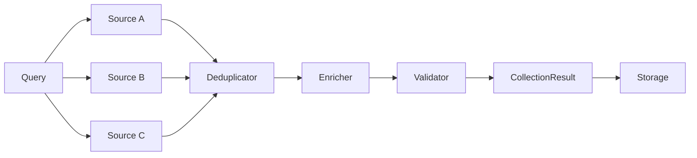

# Core Concepts

Academic Intelligence is built around four ideas: **evidence chains**, **multi-source fusion**, **incremental updates**, and **confidence scoring**. Understanding them will help you interpret results and configure the pipeline.

## Evidence chain

Every domain record (`Author`, `Paper`, `Citation`) carries an `Evidence` object that answers: *where did this come from, when, and how sure are we?*

```python
from academic_intelligence.core.models import Evidence
from academic_intelligence.core.types import SourceType

evidence = Evidence(
    source=SourceType.SEMANTIC_SCHOLAR,
    source_url="https://api.semanticscholar.org/...",
    confidence=0.9,
    raw_data={"paperId": "..."},  # optional audit payload
)
```

| Field | Meaning |
|-------|---------|
| `source` | `SourceType` enum (e.g. `semantic_scholar`) |
| `source_url` | Original URL or API endpoint context |
| `collected_at` | UTC timestamp of collection |
| `confidence` | Score in `[0.0, 1.0]` |
| `raw_data` | Optional original payload for audits |

Benefits:

- **Provenance** — trace each field back to a source
- **Auditing** — keep raw responses when needed
- **Trust** — weight multi-source merges by confidence

## Multi-source fusion

When you request multiple sources, the collector:

1. **Queries** each configured source (concurrently, up to `max_concurrent_sources`)
2. **Deduplicates** papers/authors using DOI, normalized title, and author+year similarity
3. **Merges** fields with a confidence-aware strategy (prefer higher-confidence / richer fields)
4. **Enriches** missing fields (venue normalization, DOI extraction, PDF URLs, etc.)
5. **Validates** schema and business rules
6. **Aggregates** stats and partial errors into `CollectionResult`



`CollectionResult` holds lists of authors, papers, citations, any soft errors, and stats (e.g. sources used, counts).

## Incremental updates

Full re-crawls are expensive and noisy. Incremental mode (models: `ChangeDetection`, `IncrementalUpdateResult`) is designed to:

1. Compare newly collected records with storage
2. Detect **new**, **updated**, and **removed/changed** entities
3. Write only changed fields and attach new evidence
4. Keep a change history where the pipeline supports it

Typical change signals:

- New paper IDs / DOIs for an author
- Updated citation counts
- Affiliation or interest changes

Use storage-backed queries (`query_papers`, `query_authors`) between runs to drive “what do we already know?” logic.

## Confidence scoring

Confidence is a float in `[0.0, 1.0]` on each `Evidence`. Sources set base confidence; fusion may raise or lower scores when sources agree or conflict.

| Guideline | Interpretation |
|-----------|----------------|
| High (≥ 0.8) | Strong source signal; often DOI-backed APIs |
| Medium (0.5–0.8) | Usable but may need cross-check |
| Low (< 0.5) | Below default `min_confidence`; may be filtered |

Configure with:

```python
Config(min_confidence=0.5)
```

When merging duplicates, higher-confidence field values generally win; multi-source agreement can improve the overall score recorded in result stats.

## Data models at a glance

| Model | Role |
|-------|------|
| `Evidence` | Provenance + confidence (one entry per confirming source) |
| `AuthorRef` | Lightweight byline author inside a paper (order, correspondence) |
| `Author` | Scholar profile (incl. identity IDs and disambiguation status) |
| `Paper` | Publication metadata (incl. `arxiv_id` / `pmid` / `fields_of_study` / graph relations) |
| `Citation` | Citing → cited edge |
| `CollectionResult` | Batch outcome of a collect call |
| `ExpandResult` / `ExpandStats` | Outcome of a graph `expand` pass |
| `Config` / `AntiCrawlStrategy` | Runtime configuration |

See [API: Core Models](../api/core-models.md) for generated field docs.

## Related guides

- [Data Sources](data-sources.md)
- [Collection](collection.md)
- [Storage](storage.md)
